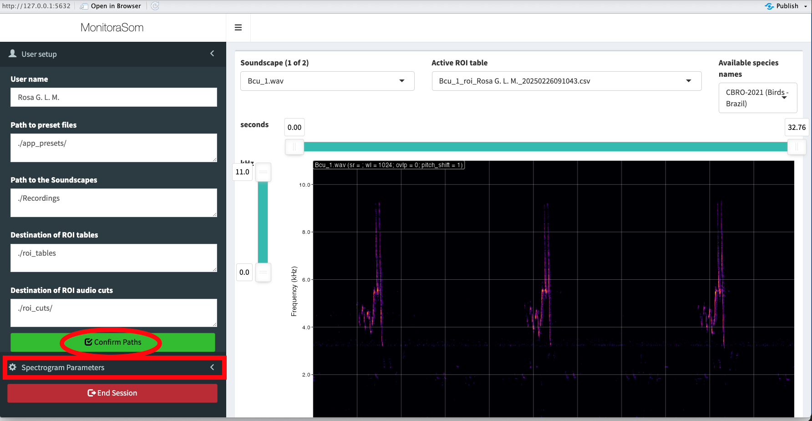
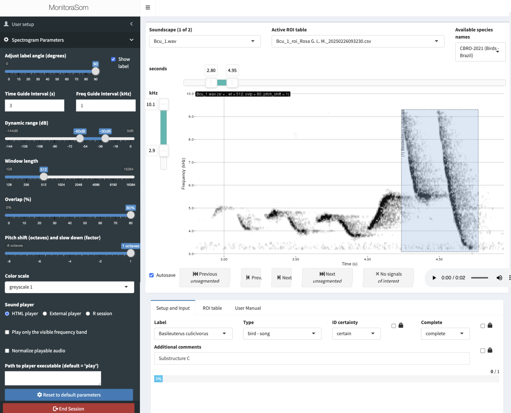
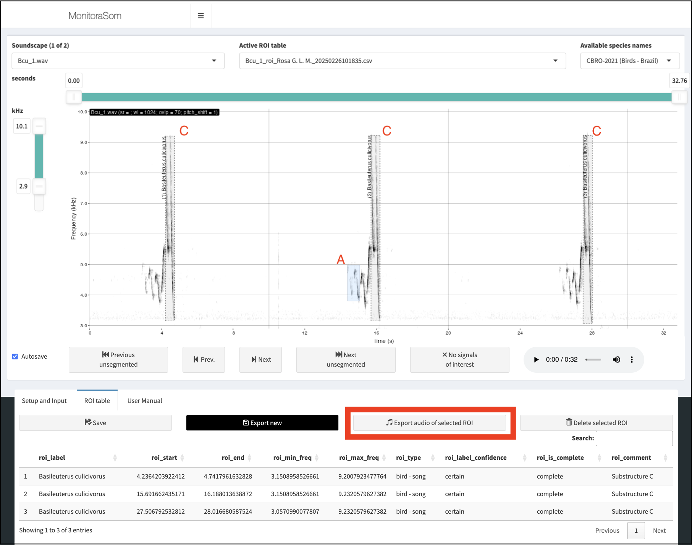
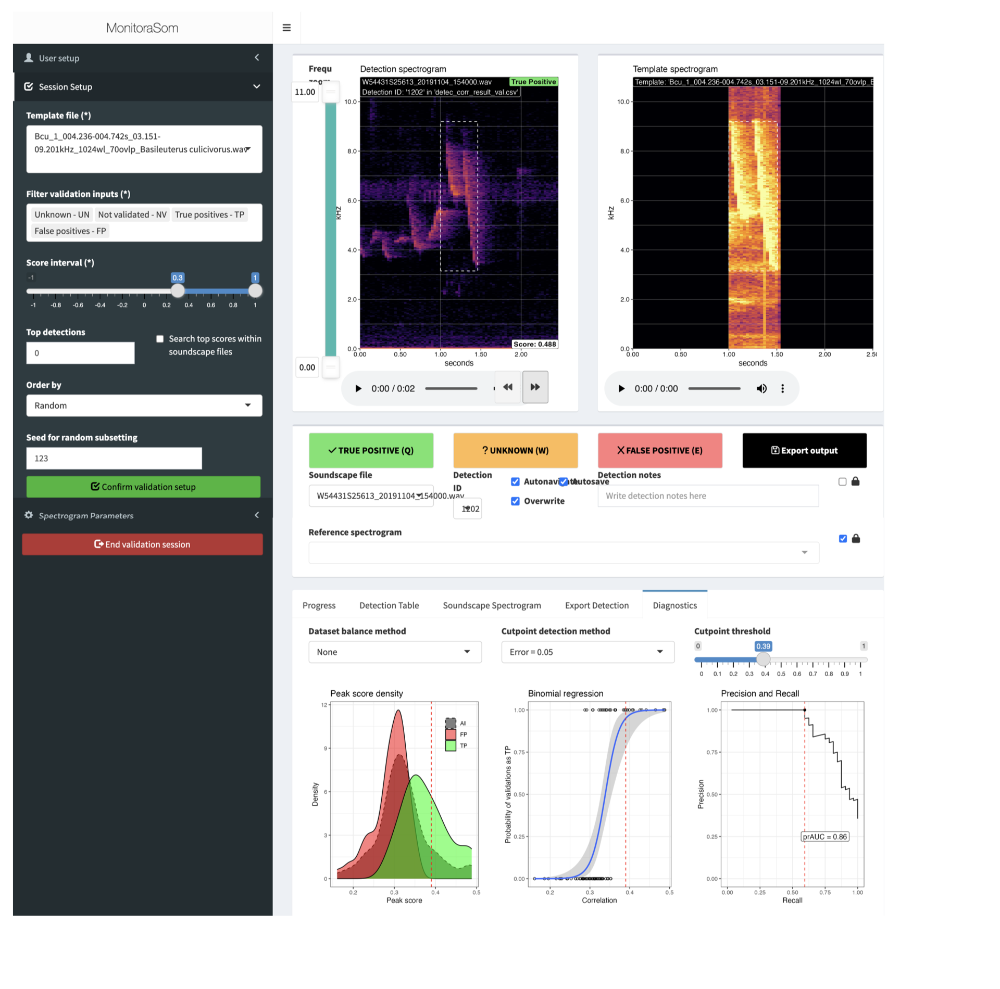

# Overview
We here provide an overview of the R package **monitoraSom**. The package is designed to facilitate passive acoustic monitoring (PAM) and bioacoustic analyses, by providing tools for processing, analyzing, and visualizing sounds for ecological studies. It includes functions for efficiently segmenting audio recordings, extracting acoustic features, building spectrograms and waveforms, and performing batch processing of large datasets. These capabilities make monitoraSom particularly useful for sound ecologists.

In this vignette we present a full workflow for a template matching analysis, with the purpose of demonstrating how to detect a specific acoustic signal within a set of soundscape recordings. The workflow presented here begins at  structuring a working directory locally, to ensure that all files are easily accessible. We here use high fidelity of recordings of *Basileuterus culicivorus* to create acoustic templates, that will be used as reference sounds in a template matching analysis. The template matching builds cross correlation analysis to search for moments in which the sounds in a set of soundscapes are similar to that of a template. The validation *a posteriori* can help establish a minimum correlation threshold that will most likely contain a target vocalization. The detections validated as true occurrences (true positives) can than be exported for ecological analysis, such as occupancy models, or used on the description of vocal diel cycles. The workflow described in this vignette provides a tool for population level bioacoustic studies.

# Setting R environment

## *Working directory structure*
Once the `monitoraSom` package is installed, you can load the libraries into your R environment. In this vignette we use packages `monitoraSom` and `dplyr`. Once we executed the function 'library()', the tools from `monitoraSom` and `dplyr` will be available for use in your R session. These tools will allow handling acoustic monitoring data effectively, and performing data wrangling tasks. The packages can be loaded with following command:

```{r, warning=FALSE, message=FALSE}
library(monitoraSom)
library(dplyr)
library(patchwork)
```

## *Folder structure*
monitoraSom is designed to handle large-scale passive acoustic data, in which the files must be systematically stored to be easily accessible and avoid problems during the analysis. The files are organized within a working directory, so our first task is to set a local folder as the working directory. To examine your current working directory use the following command:

```{r}
current_dir <- getwd()
current_dir
```

If you are running this script from a rmarkdown file in the RStudio IDE, the current working directory is the folder of the rmarkdown file. But, if you need to change it, you can use the setwd() function directly.

```{r, eval = FALSE}
setwd("path/to/your/working/directory")
```

Alternatively, you can use the following command to get the directory of the current file and set it right away as the working directory:

```{r}
current_dir <- dirname(rstudioapi::getSourceEditorContext()$path)
setwd(current_dir)
```

Withing the working directory, monitoraSom is based on a folder structure that will handle multiple files types, from sound files and data tables. You can set all the directories manually, but the easiest way to set monitoraSom's directory structure is by using the `set_workspace()` function. The function will automatically create all necessary directories using a standard structure. If you chose to include the demo data as used here, you can set the parameter `example_data = TRUE`. This will copy all the essential files from this demo into the working directory. Notice that some of the directories that are not required in this example, and can be set to NULL.

```{r}
set_workspace(
  project_path = current_dir, example_data = TRUE,
  app_presets_path = "./app_presets/",
  soundscapes_path = "./soundscapes/",
  soundscapes_metadata_path = NA,
  recordings_path = "./recordings/",
  roi_tables_path = "./roi_tables/",
  roi_cuts_path = NA,
  templates_path = "./templates/",
  templates_metadata_path = NA,
  match_grid_metadata_path = NA,
  match_scores_path = NA,
  detections_path = "./detections/",
  detection_cuts_path = NA,
  detection_spectrograms_path = NA,
  validation_outputs_path = "./validation_outputs/",
  validation_diagnostics_path = "./validation_diagnostics/"
)
```

# Launching the segmentation app

There is not a single way to use the segmentation app, as it is designed to be a multipurpose tool that can be used for multiple objectives. it can be used as a quick visualiziation tool to quickly inspect recordings, to list species present in sound files, to evaluate species repertoire, to measure specific behavioral aspects of the call, etc.

Now that the directories are in place, let's launch the segmentation app with a minimal setup. The essential parameters to launch the app are the paths to the project folder (`project_path`), the path to the soundscapes folder (`soundscapes_path`), the path where to store the ROI tables folder (`roi_tables_path`), and the user identification (in this case set as `user`). You might take note of your ideal settings, and establish the paths directly on the launch_segmentation_app(). The app will be launched by executing the command below.

```{r eval = F}
launch_segmentation_app(
    project_path = ".", user = "User Name",
    soundscapes_path = "./soundscapes/",
    roi_tables_path = "./roi_tables/"
)
```

Note that, once the app is open, it will be rendered in a pop-up window. Check if the window dimensions are appropriate for your screen size. If not, you can resize the window by dragging the edges of the window. If the window is too small, or the resolution of the screed is too low, the app interface elements might not display properly. If the app is rendered corrently, make sure to check the paths on the sidebar before you press the 'confirm path' button (red in figure 1) to render the spectrogram of the first file. For your convenience, the sidebar can be hidden, providing a larger workspace for ROI selection.

{ width=95%}

In the Spectrogram Parameters menu (highlighted with a red rectangle in Figure 1), you can access spectrogram parameters to adjust the display of the spectrogram. These parameters can be controlled within the app for immediate use or preset on the function arguments, before launching the app. Within the menu you can also reset to values passed to the launch function using the "Reset to default parameters" button, located at the bottom of the spectrogram settings tab in the sidebar (Figure 2). Remember to take note of your favorite settings before closing the app to pass them as a new default to the launch function.

Now that spectrogram parameters are set, you can visually search for a signal of interest in the spectrogram, use play button (spacebar) to listen to it, and select a region of interest (ROI) using the mouse. Once you press 'E' on the keyboard, the selection's metadata will be stored as one row on the ROI table of the current soundscape. Several parameters of the ROI are stored at this point, includuing the minimum and maximum frequency, as well as its start and end within the soundscape recording. However, there are other data that can be added to the ROI before it is stored. These data include several relevant information on the label of the ROI, such as the species, call type, and the certainty of the label. The input fields to add this information to a ROI are available in a panel below the spectrogram. You select the species label from a specific list of taxa, which can be found at the `"/app_presets"` folder, as a XLSX file. Out of the box, `monitoraSom` offers multiple species lists, from multiple authorities, stored as columns in the XLSX file. Our example includes the list of the Brazilian birds from CBRO (2021) and Argentinean birds by Aves Argentinas. Other lists are also available, such as the list of amphibians from Brazilian Herpethological Society (2021) and the bats of Brazil from CLMB (2020). Among the input to the current ROI, you can also select the signal type from a wide range of preloaded repertoire components from a bat feeding buzz, to a frog advertisement call or a bird song-duet. Ensure that the metadata is as complete as possible, including information on label's certainty, which is crucial for quality control. Misidentifications might be difficult to spot at other steps of the workflow. Therefore, entries with uncertain identification should be clearly identifias as such, allowing specialists to review it as needed.

In this example we preloaded the ROI tables with all songs of *B. culicivorus* present in the soundscape recordings. It is good practice to identify and label all occurrences of the target species. The songs of *B. culicivorus*, such as many animal voices are structured across multiple hierarchical levels. For instance, birds can produce groups of notes (units of acoustic events) that together form song phrases. A bird recording that captures repeated phrases contains the highest level of vocal organization, and can be considered a 'complete' recording. Therefore, at which hierarchical levels the segmentation is performed depends on the objective of the analysis. In this example, we will segment the complete songs of *B. culicivorus* into substructures A, B, and C, which are consistent across multiple songs.

Lets launch the app again, with a more complete setup, but instead of segmenting soundscape recordings, now we will segment focal recordings from the target species. Observe the structure of the song of *B. culicivorus* in the spectrogram, and how consistent the substructures are across multiple songs. Avoid excluding the preloaded ROIs from this example, to ensure the consistency of the next steps.

```{r eval = F}
launch_segmentation_app(
  project_path = ".", user = "User Name",
  soundscapes_path = "./recordings/",
  roi_tables_path = "./roi_tables/",
  time_guide_interval = 10, freq_guide_interval = 1,
  dyn_range = c(-60, -24), wl = 1024, ovlp = 70,
  zoom_freq = c(2.9, 10.1), color_scale = "greyscale 1"
)
```

{ width=95%}

Lets review how the segmentation process works:

1. *Lauching the app.* Launch the app with the `launch_segmentation_app()` function passing the correct paths to the `project_path`, `soundscapes_path`, and `roi_tables_path` arguments.
2. *Confirm paths.* Click the "Confirm paths" button. If the paths are correct, the spectrogram of the first soundscape will be displayed.
3. *Navigating files.* Zoom in the frequency range using the W and S keys, or by clicking and dragging the time and frequency sliders until the desired range is selected. The visible frequency band of the spectrogram affects data retrieval, so it is important to be consistent throughout an analysis. Proceed if you are satisfied with the spectrogram window settings.
4. *Searching for signals.* Search for a signal of interest in the spectrogram, and fill the metadata of the ROI you are about to create as completely as possible.
5. *Drawing a ROI.* Click and drag the mouse to draw a rectangular selection around the signal of interest in the spectrogram. Press the `E` key to store this selection as a ROI in the current ROI table. The metadata fields you previously filled will be automatically applied to any new ROIs you create, so you don't need to re-enter this information for each selection, unless you want to change some of the information.
6. *Follow the workflow.* Repeat steps 3 and 4 for each signal of interest in the spectrogram until the objective of the segmentation is achieved (all ROIs from the current soundscape can be reviewed in the ROI table tab below the spectrogram). This process is desinged to be highly efficient if you segment signals from one species at a time.
7. *Navigate soundscapes.* Navigate between the recordings using the `Z` and `C` keys, repeating the steps above until all the soundscapes are segmented. If the autosave option is enabled, the ROI tables will be saved automatically as CSV files in the path passed to the `roi_tables_path` argument, otherwise it will be necessary to save it manually before changing files to avoid data loss (ROI data is not stored within the R session). Navigation between soundscapes is also possible by using the soundscape dropdown menu on top of the spectrogram.

# Building templates
## *Manual template extraction*

In cases such as this, with multiple songs of the target species, one might use R to extract basic parameters for further analysis, but it is also possible to use the segmentation app to extract the templates interactively. We will first demostrate the method to extract the templates mannualy from within the segmentation app using the button 'export audio files' (see the figure below). but there is also a dedicated function (more suited for large scale use cases) that we will demonstrate later.

In our case multiple substructures of the song of *B. culicivorus* were selected for use as templates. Visualizing the spectrogram and ROIs within the app can be helpful to pick the right substructures and perform more direct quality control over template extraction process. Once the ROIs are selected in the ROI table tab, the user can export all the ROIs as templates at once for later use.

{width=95%}

Check the `roi_cuts` folder to see the templates extracted from the soundscape recordings.

## *Automatic audio extraction*

Although we use a small set of soundscape recordings in this example, the segmentation process for template extraction demostrated is the same as the one used for large scale template matching analysis. Lets see how to do it using the `export_roi_cuts_n()` function. But first, we need to import the ROI tables back into R. The `fetch_rois` function will return a dataframe that aggregates all the ROIs in the `roi_tables` directory.

```{r}
df_rois <- fetch_rois(rois_path = "./roi_tables/")
glimpse(df_rois)
```

Using the `export_roi_cuts_n()` functon requires a roi table with the cuts (or templates) that will be exported, which get using the `fetch_rois()` function. Lets quickly check what are the recordings represented in the `df_rois` dataframe.

```{r}
count(df_rois, soundscape_file)
```

We can promptly see that it includes both the ROIs from the soundscape recordings and the ROIs from the focal recordings. We have colected three substructures for each song (3), of three different songs (3), from two distinct sound recordings (2), totaling 18 templates. We also have 53 ROIs from the soundscape recordings, which have no information about the substructure in the `roi_comment` column. It is important to note that filtering the desired ROIs is necessary to avoid exporting all ROIs from this dataframe. Lets check the number of ROIs per Substructure colected during the segmentation process to see if we can use this information to guide the filtering process.

```{r}
count(df_rois, roi_comment)
```

Yes, we can easily identify that ROIs from soundscape recordings have no information about the substructure in the `roi_comment` column. We can use this information to filter the ROIs that will be exported as templates. The filtering strategy is open to the user's creativity. In the example below, we filter the ROIs that have the word Substructure C in the content of the `roi_comment` column. This will ensure at a single step that ROIs from soundscape recordings are not included, and only the templates of the  substructure are exported.

```{r, warning=FALSE, message=FALSE}
df_rois_filtered <- df_rois %>%
    filter(grepl("Substructure C", roi_comment))
glimpse(df_rois_filtered)
```

Now we can export the templates using the `export_roi_cuts_n()` function. Note that we have routed the output to the `./templates` directory.

```{r, warning=FALSE, message=FALSE}
export_roi_cuts_n(
    df_rois = df_rois_filtered,
    roi_cuts_path = "./templates",
    overwrite = TRUE
)
```

Although templates can be created manually from within the segmentation app, using the `export_roi_cuts_n()` is the most straightforward way to export the templates. The file name contain all the necessary information for an standalone template, making it easily used downstream in the analysis. Nevertheless, storing metadata in file names has some drawbacks, which will be addressed in future versions of monitoraSom.

# Template matching

Template matching is a technique used in passive acoustic monitoring (PAM) to detect specific sound patterns within large audio datasets by correlating recordings with acoustic templates containing the target species' sounds. When the structure of a template closely matches a segment of the soundscape, high correlation values (i.e. a correlation peak) indicate what could be likely an occurrence of the target species' acoustic signal. Then, the validation app can be used to assess results, refine the detection accuracy, and export data for further ecological analysis. While not as precise as human audio inspection, template matching is highly efficient for large-scale sound analysis, making it a valuable tool for bioacoustic research.

To run a template matching analysis, two distinct datasets are required: environmental sound recordings typically obtained in large quantities (the soundscapes) and at least one template, which is usually a valid high-fidelity recording of the target species used as a reference for detection.

Let's start by gathering the metadata of the soundscapes.

```{r, warning=FALSE, message=FALSE}
df_soundscapes <- fetch_soundscape_metadata(
  soundscapes_path = "./soundscapes", recursive = TRUE, ncores = 1
)
glimpse(df_soundscapes)
```

And now lets select the searching template files of *Basileuterus culicivorus*, as gathered in the first part of this exercise.

```{r, warning=FALSE, message=FALSE}
df_templates <- fetch_template_metadata(
    templates_path = "./templates",
    recursive = TRUE
)
glimpse(df_templates)
```

By combining both data frames, we create a comprehensive map of correlations to be performed during the cross-correlation analysis.

```{r, warning=FALSE, message=FALSE}
df_grid <- fetch_match_grid(
    soundscape_data = df_soundscapes,
    template_data = df_templates
)
glimpse(df_grid)
```

At this stage, users can filter specific template-soundscape combinations to optimize processing or meet experimental design requirements. This is one of the most important checkpoints of the workflow, as it allows the user to have granular control over the analysis. The resulting data frame has one row per template-soundscape pair along with their metadata, which includes the template spectrogram parameters that will be used to perform the cross-correlation analysis.

Lets make a quick check to ensure that the template and soundscape sample rates are compatible.
```{r}
# check the sample rates
df_grid %>%
  select(soundscape_sample_rate, template_sample_rate) %>%
  distinct()
```

Lets also check that the overlap and window length are appropriate for the analysis. We expetc template overlap to be 70% and window length to be 1024.
```{r}
# check the overlap
unique(df_grid$template_ovlp)
# check the window length
unique(df_grid$template_wl)
```

Now that we have defined the grid and confirmed sample rate compatibility, we can proceed with the template matching analysis. This process performs cross-correlation by systematically sliding each template across the time axis of the soundscapes, as specified in our grid. Cross-correlation is a powerful signal processing technique that quantifies the similarity between two signals (in this case, the template and sections of the soundscape) at different time offsets. The resulting correlation values indicate how well the template matches the soundscape at each position, allowing us to identify potential occurrences of the target species' vocalizations.

Because this is the most time-consuming step of the analysis, users should evaluate whether our hardware can efficiently handle the computation before proceeding. In this example, we run a small test using 12 soundscapes and 6 templates, which gives us a grid of 72 template matching operations. It took approximately 17 seconds to be completed using 6 cores of a M2 Apple processor, or 65 seconds using 6 cores of an Intel i7-10700 (4.800GHz) processor in Ubuntu 24.04. However, processing time can vary significantly depending on the computer's specifications. The results will be saved in a CSV file, within the `"detections"` folder.

Lets make a time check to see how long it takes to run the template matching analysis with 6 cores. Attention, check if you have 6 cores available in your computer before running the analysis. If you have less, you can change the number of cores. Avoid using all cores, as it might slow down the analysis.
```{r, warning=FALSE, message=FALSE}
# check the number of cores available
# parallel::detectCores()

# If the parallelization is working, this elapsed time...
match_n(
  df_grid = df_grid, output = "detections", ncores = 6,
  output_file = "detections/df_detecs.csv"
)
```

If results with parallel processing and single core processing are not significantly different, parallelization is not working properly. There can be several reasons for this, as parallelization is dealt differently across operating systems (MacOS, Windows, or Linux) and IDEs (RStudio, VSCode, etc.).

# Validation and template matching evaluation

The main objective of the validation process is to determine the optimal correlation threshold for efficient detection. The correlation threshold value directly influences the number of true positives and false positives in the results. While a higher correlation threshold tends to reduce false positives by ensuring that only strong matches are retained, it also reduces the number of true positives as the model becomes more selective. On the other hand, a lower correlation threshold increases recall by capturing more true positives, but at the cost of a lower precision, as it leads to a higher number of false positives above the threshold. The ideal threshold strikes a balance between precision and recall, ensuring sufficient data for ecological analysis while maintaining the quality of the results.

We will first demonstrate the validation process using the validation app, within which the user can validate the detections manually. Because validation takes place with data produced after the template matching process, this validation is referred to as **a posteriori** validation.

The file we will passs to the argument `input_path` should be the output of the `match_n()` function, *i.e.*, "detections/df_detecs.csv". However, it might be important to save the output file with a different name than the input file to preserve data and avoid rerunning the template matching process. With the steps below, we will make a copy of the detections file and use it as the input for the validation app.
```{r}
original_file <- "detections/df_detecs.csv"
validation_file <- "validation_outputs/df_detecs_val_manual.csv"
# check if original file exists and copy doesn't exist yet
if (
  file.exists(original_file) && !file.exists(validation_file)
  ) {
  # save a backup copy of the detections file
  file.copy(from = original_file, to = validation_file)
} else if (!file.exists(original_file)) {
  stop("The file 'detections/df_detecs.csv' does not exist.")
} else {
  message("Validation copy already exists, skipping copy.")
}
```

Now we can launch the validation app. Notice that we are using the validation copy as the input file and also as the output file. This is a good practice to avoid overwriting the original data and to ensure we can validate the same data across multiple sessions.

```{r eval = F}
launch_validation_app(
  project_path = ".",
  validation_user = "Rosa G. L. M.",
  templates_path = "templates/",
  soundscapes_path = "soundscapes/",
  input_path = "validation_outputs/df_detecs_val_manual.csv",
  output_path = "validation_outputs/df_detecs_val_manual.csv",
  dyn_range_templ = c(-42, 0), dyn_range_detec = c(-90, -48),
  wl = 512, ovlp = 70, time_pads = 0.5, nav_autosave = TRUE, overwrite = TRUE,
  auto_next = TRUE, path_update = FALSE
)
```

{width=100%}

Once we launch the Validation App, we can validate the detections as true or false positives and set a correlation threshold that balances precision and recall. Similar to the Segmentation App, the Validation App requires specific inputs to function properly. The project path is typically set to the working directory, and the user's name must be provided. Additionally, the paths to the template and soundscape files should be specified. Within the app, the user must check the information and confirm the paths by clicking the 'confirm path' button. The user must then advance to the session setup tab, also in the sidebar menu, to confirm the validation setup. Within this menu, the user can select which template to validate, the correlation score interval or determine a number of the top scores to be validated. Additionally, the 'Order by' dropdown menu allows the user to control the order in which the detections are presented for validation.

The app presents two spectrograms to facilitate the validation process. The spectrogram parameters can be adjusted through the spectrogram menu. The left spectrogram displays the detection from the soundscape file, while the right shows the template used in the correlation. The user can easily classify the detection as false (Q), positive (E), or unknown (W). If the Autosave and Autonavigate boxes are checked, the validation process becomes very efficient, automatically saving the classifications and navigating to the next detection. Additionally, the user can listen to either the detection or the template to assist the validation process. As the validation process advances, the detection table is updated with the validation inputs, and the resulting data is used in a diagnostic analysis model employing a binomial regression. The validation app is typically set to assess correlation values with a precision of 95% (5% error). Along with the binomial regression plot, users can also see the density plots of correlation values for both false positives and true positives, and the precison vs recall plot. All these plots are updated in real time, allowing the user to evaluate the outcomes of the validation in real time.

It should be noted though that the only output of the validation app are the validation iputs routed to the CSV file passed to the `input_path` argument. The diagsnotics data and plots are only displayed in the app, but can be coimputed with the `diagnostic_validations_n()` function.

```{r}
# import the validated detections
df_detecs_val_manual <- read.csv(
  "validation_outputs/df_detecs_val_manual.csv", row.names = 1
)
# compute the diagnostics
ls_validations <- diagnostic_validations_n(
  df_validated = df_detecs_val_manual,
  diag_method = "auto", pos_prob = 0.9
)
```

Lets extract and plot the diagnostics for the first template. The `ls_validations` object is a list in which each element is a list of diagnostics for a given template.

```{r, fig.width=10, fig.height=8}
# extract the diagnostics for the first template
diags_template01 <- ls_validations[[1]]
# plot the diagnostics
x11()
diags_template01$mod_plot +
  diags_template01$precrec_plot +
  diags_template01$f1_plot +
  diags_template01$plot_dens
```

We can see that the top-left panel shows the plot of the binomial model used to estimate the score threshold with a minimum precision of 95% (5% error). It shows that we were able to estimate the score threshold with a minimum precision of 95% (5% error), and altrhough no false positives were found, we missed a lot of true positives (i.e. we have a lot of false negatives). The top-right panel shows the precision-recall plot, which shows the precision and recall of the template matching process at different correlation thresholds. We can see in this case that we can reach a recall slightly above 50% with full precision, yet to increase the recall, we would need to accept a lower precisions. The bottom-left panel shows the F1 score plot, which shows the F1 score of the template matching process at different correlation thresholds. The F1 score is the harmonic mean of the precision and recall, and it is a good indicator of the overall performance of the template matching process. Yet, because we will prioritize precision over recall, the most adequate threshold is the one that maximizes the precision. The bottom-right panel shows the density plot of the correlation values for both false positives and true positives. The extensive tail of the false positives distribution shows that the template matching process is very good at detecting the target species, but it is not perfect.

Before extracting the final set of validations based on the correlation thresohold, let's try another type of validation and compare the results. The alternative to the validation app is to use the `validate_by_overlap()` function, which allows the user to validate the detections automatically based on the overlap between the detections and ROI tables of the soundscape recordings produced within the segmentation app. This validation method is referred to as **a priori** validation, as it is based on data previously available, namely the segmentation data from the soundscape recordings.

Before proceeding, we need to import the ROIs.
```{r}
# import the ROIs
df_rois <- fetch_rois(rois_path = "./roi_tables/")
glimpse(df_rois)
```

Now we can validate the detections by overlap with the ROIs. Detections that overlap with at least one ROI in the time window are validated as true positives, and all other detections are validated as false positives.
```{r}
df_detecs_val_tovlp <- validate_by_overlap(
  df_detecs = df_detecs, df_rois = df_rois, validation_user = "User Name",
  output_path = "validation_outputs/df_detecs_val_tovlp.csv"
)
glimpse(df_detecs_val_tovlp)
```

But if we count the number of detections by validation outcome, we see that there is a third outcome, which is the FN ou false negatives. False negatives, in this case, are ROIs that were missed by the template matching process, i.e. ROIs that do not overlap with any detection.
```{r}
count(df_detecs_val_tovlp, validation)
```

If we perform the validation diagnostics again, we see that the taking FN into account does interfere with the performance metrics of the template matching process.
```{r}
# compute the diagnostics
ls_validations_tovlp <- diagnostic_validations_n(
  df_validated = df_detecs_val_tovlp,
  diag_method = "auto", pos_prob = 0.85
)
# get the results for the first template
diags_template01_tovlp <- ls_validations_tovlp[[1]]
X11()
# plot the diagnostics
diags_template01_tovlp$mod_plot +
  diags_template01_tovlp$precrec_plot +
  diags_template01_tovlp$f1_plot +
  diags_template01_tovlp$plot_dens
```

A more close look into the diagnostics of the second round of validation shows a few important patterns. First, we had to lower the precison thresohold to 0.85 to stay within the testable range of the binomial model. We also see that show that precisio starts to drop near a recall of 25%, wich is much sooner than the 50% recall we had with the a posteriori validation. We see that compromises between precision and recall are similar to the a posteriori validation. However, the F1 score range is lower, which show a less consistent detection performance. The density plot of the TP and FP distributions shows a less clear separation between the two distributions. The soundscpes, templates and detections are the same as in the a posteriori validation, so what changed is the validation method. Because the validation by overlap does not account for false negatives, we see that athough the template is useful, maybe we should keep looking for a better template.

As rule of thumb, we recommend using the validation app for exploratory analyses, and the validation by overlap for large scale use cases. When compating templates, users should look for templates with a clearly defined prodabiblity of classification as true in the binomial model, which sustain a high precision and recall at the same time, with high F1 scores at the selected precision threshold and a clear separation between the TP and FP distributions. Sometimes it is not easy to find a template that satisfies all these criteria, which is why we recommend to always evaluate a set of different templates under varying settings.

For now we are satisfied with the results, so we can export the final set of validations based on the correlation threshold.
```{r}
# first we retrieve the threshold determined by the diagnostics
selected_thres <- ls_validations_tovlp[[1]]$score_cut
# Then we simply filter the detections based on the threshold
df_detecs_val_final <- df_detecs_val_manual %>%
  filter(peak_score >= selected_thres) %>%
  glimpse()
```

The final step is to prepare the detections for ecological analysis.

## Summary

*A typical template matching analysis is made by the following steps:*

1. *Data Collection.* Gather a large dataset of audio recordings, typically from soundscapes that include the target species' calls or sounds.

2. *Template Creation.* Define or select acoustic templates that represent the target species' sounds. These templates are usually manually curated from high didelity recordings and represent the characteristic frequency patterns of the species' calls.

3. *Preprocessing of Audio*. Process the audio data to prepare it for analysis. This can include editing the auddio recordings to enhance the signa; to noise ratio of the templates, to segmenting audio into manageable parts, or changing the sampling rate of the template so that it matches the sampling rate of the soundscapes.

4. *Fetching templates.* Select the templates and include them in a R object.

5. *Fetching Soundscapes* Select the soundscapes folder, and create a list in a R object.

6. *Fetching Soundscapes* Create a correlation grid for the anaysis

7. *Template Matching.* Use 'match_n()' function to compute the correlations between the template and the soundscape at different time points.

8. *Thresholding and Identification.* Validade the detections to set a correlation threshold that balances precision and recall

9. Scale up. Use the correlation threshold to filter out false positives from a larger set of soundscape recordings

10. *Post validation.* Select a sample of the large scale data to execute a final validation.

11. *Hypothesis testing* Once the analysis validated, export the results for further ecological analysis, such as determining species occupancy, activity patterns, or habitat use.


