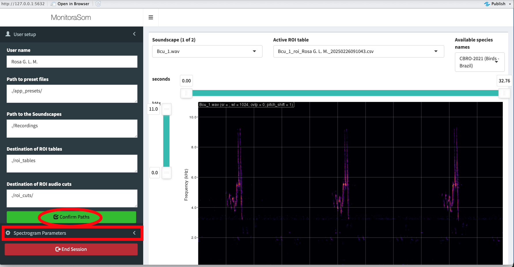
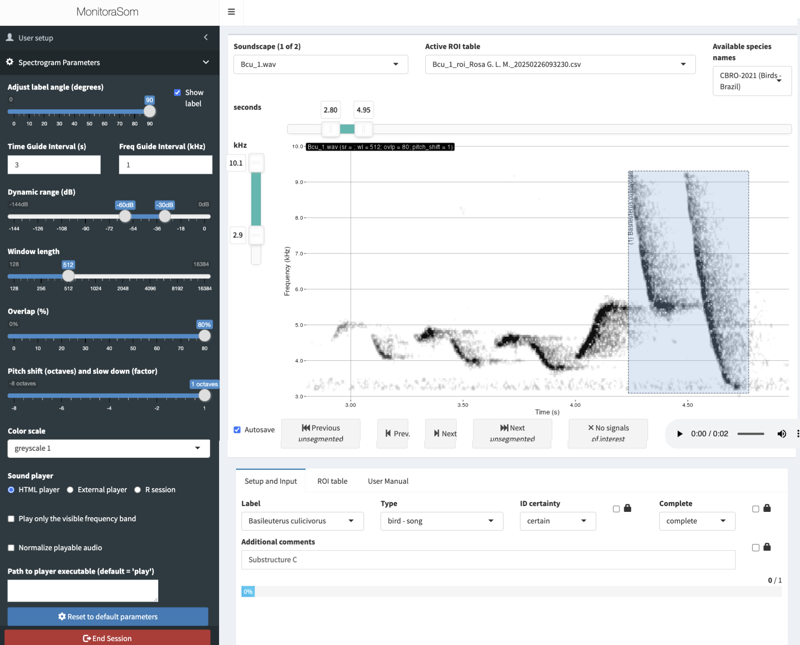
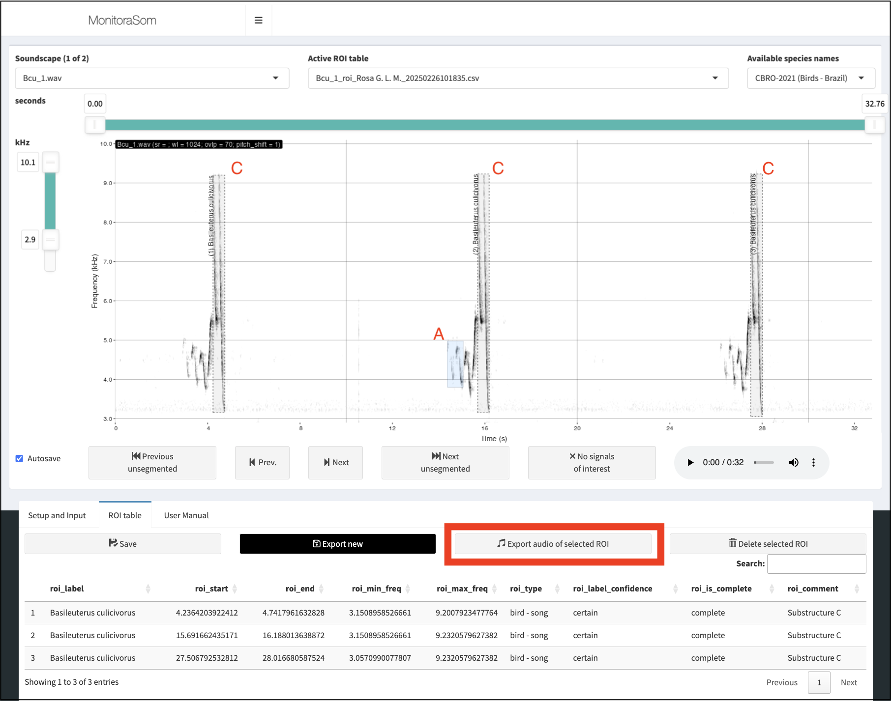
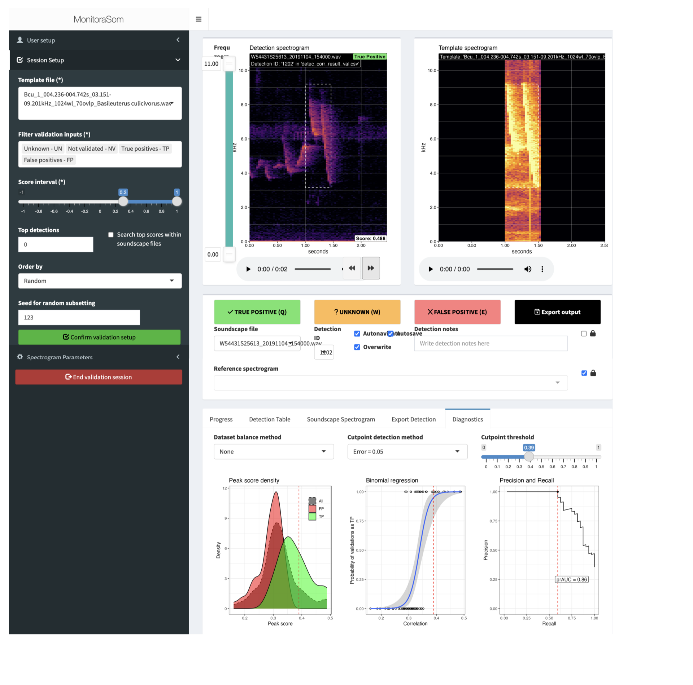

# Overview
We here provide an overview of the R package **monitoraSom**. The package is designed to facilitate passive acoustic monitoring (PAM) and bioacoustic analyses, by providing tools for processing, analyzing, and visualizing sounds for ecological studies. It includes functions for efficiently segmenting audio recordings, extracting acoustic features, building spectrograms and waveforms, and performing batch processing of large datasets. These capabilities make monitoraSom particularly useful for sound ecologists.

In this vignette we present a full workflow for a template matching analysis, with the purpose of demonstrating how to detect as specific acoustic signal within a set of soundscape recordings. The work flow presented here begins at  structuring a working directory locally, to ensure that all files are easily accessible. We here use high fidelity of recordings of *Basileuterus culicivorus* to create acoustic templates, that will be used as reference sounds in a template matching analysis. The template matching builds cross correlation analysis to search for moments in which  the sounds in a set of soundscapes are similar to that of a template. The validation  *a posteriori* can help establish a minimum correlation threshold that will most like it contain a target vocalization. The validated (true) detections can than be exported for ecological analysis such occupancy models, or used ion the description of vocal diel cycles. The workflow described in this vignette provides a tool for population level bioacoustic studies.

# Setting R environment

## *Working directory structure*
To start using the package in R, you first need to load the libraries into your R environment. In this vignette we use packages monitoraSom and dplyr. Once we executed the function 'library()', the tools from monitoraSom and dplyr will be available for use in your R session. These tools will allow handling acoustic monitoring data effectively, and performing data wrangling tasks. The packages can be loaded with following command:

```{r, warning=FALSE, message=FALSE}
library(monitoraSom)
library(dplyr)
library(bench)
library(purrr)
library(ggplot2)
```

## *Folder structure*
monitoraSom is designed to handle large-scale passive acoustic data, in which the files must be systematically stored to be easily accessible. The files are organized within a working directory, so our first task is to set a local folder as the working directory. To examine your current working directory use the following command:

```{r}
current_dir <- getwd()
current_dir
```

And if you need to change it, you can use the setwd() function directly:

```{r}
setwd("path/to/your/working/directory")
```

Alternatively, you can use the following command to get the directory of the current file and set it as the working directory:

```{r}
project_path <- dirname(rstudioapi::getSourceEditorContext()$path)
setwd(project_path)
```


Withing the working directory, monitoraSom is based on a simple folder structure, that will handle multiple files types, from sound files and data tables. You can set all the directories manually, but the easiest way to set monitoraSom's directory structure is by using the `set_workspace()` function. The function will automatically create all necessary directories using a standard structure. If you chose to include the demo data as used here, you can set the parameter `example_data = TRUE`. This will copy all the essential files from this demo into the working directory. Notice that some of the directories that are not required in this example, and can be set to NULL.

```{r}
set_workspace(
  project_path = project_path, example_data = TRUE,
  app_presets_path = "./app_presets/",
  soundscapes_path = "./soundscapes/",
  soundscapes_metadata_path = NA,
  recordings_path = "./recordings/",
  roi_tables_path = "./roi_tables/",
  roi_cuts_path = NA,
  templates_path = "./templates/",
  templates_metadata_path = NA,
  match_grid_metadata_path = NA,
  match_scores_path = NA,
  detections_path = "./detections/",
  detection_cuts_path = NA,
  detection_spectrograms_path = NA,
  validation_outputs_path = NA,
  validation_diagnostics_path = NA
)
```

# Launching the segmentation app

Now that the directories are in place, let's launch the segmentation app with a minimal setup. A basic app launch must specify the paths to the project folder, soundscape folder, ROI tables folder, and the user. You might take note of your ideal settings, and establish the paths directly on the launch_segmentation_app(). Once the app is open, it will require path confirmation before it can run correctly. Make sure to check the  paths on the left before you press the 'confirm path' button (red in figure 1) to build the spectrogram of the first file.

```{r eval = F}
launch_segmentation_app(
    project_path = ".",
    user = "User Name",
    soundscapes_path = "./010_soundscapes/",
    roi_tables_path = "./030_roi_tables/"
)
```

{ width=95%}


In the Spectrogram Parameters menu (highlighted with a red rectangle in Figure 1), you can access spectrogram configurations. These can be controlled by using the sliding bars on the left. When launching the segmentation app you can specify the parameters for the spectrogram  directly on the function arguments. You can also reset to defaults using the "Reset to default parameters" button, located at the bottom of the spectrogram settings (Figure 2).

Now that sonogram parameters are set you can visually search for a signal of interest in the spectrogram, use play button (spacebar) to listen to it, and select a region of interest (ROI) using the mouse. Once you press 'E' on the keyboard, you store the selection's metadata on the ROI table. Several parameters are kept at this point. Of course the minimum and maximum frequency of the ROI, as well as its initial and end time. Below the spectrogram you can select the species label from a specific list of taxa. The list of taxa can be found at the sub folder /app_presets, as a csv file. There are multiple species list, from multiple authorities, and each can be put in a separate column on the csv file. In our example we include the list of the Brazilian and Argentinean birds by CBRO (2021) and Aves Argentinas, as well as the list of amphibians from Brazilian Herpethological Society (2021) and the bats of Brazil from CLMB (2020). You can also select call type, from a wide range of repertoire components from a bat feeding buzz, to a frog advertisement call and a bird song-duet.
Ensure that metadata is as complete as possible, including information on label's certainty. Label quality is crucial, as misidentifications might be difficult to detect over time. Uncertain entries should be clearly marked, allowing specialists to revisit them as needed.
Animal voices are structured across multiple hierarchical levels. For instance, birds produce groups of notes that together form its song phrases. A bird recording that captures repeated phrases contains the highest level of vocal organization, and here is classified as a 'complete' recording. It is essential to highlight when labels captures multiple phrases. A complete voice recording preserves the highest organizational level of vocalizations—such as the full sequence of frog calls, bird phrases or a bat pass. Complete calls can provide all relevant parameters, including singing rate.


```{r eval = F}
launch_segmentation_app(
  project_path = ".", user = "User Name",
  soundscapes_path = "./010_soundscapes/",
  roi_tables_path = "./030_roi_tables/", time_guide_interval = 10,
  freq_guide_interval = 1, dyn_range = c(-60, -24), wl = 1024, ovlp = 70,
  color_scale = "greyscale 1", zoom_freq = c(2.9, 10.1)
)
```

{ width=95%}

## *A typical segmentation will happen as follows:*

1. *Lauching the app.* Launch the app and click the "Confirm paths" button. If the paths are correct, the spectrogram of the first soundscape will be displayed.
2. *Navigating files.* Zoom in the spectrogram using the W and S keys, or by clicking and dragging the time and frequency sliders until the desired time and frequency range is selected.  The window will affect data retrieval, so it is important to maintain window dimensions throughout an analysis. Proceed if you are satisfied with the spectrogram window settings.
3.*Searching for signals.* Search for a signal of interest in the spectrogram and make and insert the metadata into the ROI are about to create. Make the metadata as complete as possible.
4. *drawing a ROI.* Click and drag the mouse to draw a box around the signal of interest and press the E key to store a ROI for the current soundscape. The metadata used in the first ROI can be reused for the next.
5. *follow the workflow.* Repeat steps 3 and 4 for each signal of interest in the spectrogram until the objective result is achieved. The process can be highly efficient if you inspect on species art a time.
6. *Navigate soundscapes.* Navigate between the soundscapes using the Z and C keys, repeating the steps above until all the soundscapes are segmented. If the autosave option is enabled, the ROI tables will be saved automatically as CSV files in the `roi_tables` path, otherwise you will need to save the tables manually before changing files to avoid losing data.

# Building templates
## *Manual template extraction*
For your convenience you might hide the spectrogram menu, providing a larger workspace for ROI selection. On the ROI table tab you have further information on each ROI on the recording, and you may swuich the recording from the soundscape dropdown menu. If multiple songs of the species are captured, one might use R to extract basic parameters such as emission rate, and song inspection is classified as complete. In our case multiple substructures of the song of *Basileuterus culicivorus* are being selected to be used as templates in a template matching analysis, so that in the same sound recording substrutures can be selected, as in the blue retangle is selecting a second ROI from the file, that consist of another substructure (substrucure A).

{width=95%}

In this example we focus into the segmentation process for template extraction,  to be used as a template in a large scale template matching analysis. In fact, the segmentation app can be used for multiple objectives, and from quickly inspecting recordings to obtain a list species list of a sound file, to evaluating species repertoire or measuring specific behavioral aspects of the call.

Now let's import the ROI tables back into R. The `fetch_rois` function will return a dataframe that aggregates all the ROIs in the `roi_tables` directory.

```{r}
df_rois <- fetch_rois(rois_path = "./030_roi_tables/")
glimpse(df_rois)
```

Let's check the number of ROIs per Substructure colected during the segmentation process. We have colected three substructures for each song (3), of three different songs (3), from two distinct sound recordings (2), totaling 18 templates.

```{r}
count(df_rois, roi_comment)
```

## *Automatic audio extraction*

Let's extract the templates from the soundscapes. There are two ways to do this. It can be done mannualy frpm he segmentation app using the button 'export audio files', as shown above, mbut we can also extract the templates automatically, based on a set of ROI tables, using the `export_roi_cuts_n()` function.

Using the `export_roi_cuts_n()` functon, requires a roi table with the cuts (or templates) that will be exported. In the example below, we show that this uses df_rois, wihch is the output of the `fetch_rois()` function. It is important to note that filtering the desired ROIs is necessary to avoid exporting all ROIs from this dataframe. The filtering strategy is open to the user's creativity to allow for different ways to filter the ROIs. In the example below, we filter the ROIs that have the word Substructure C in the content of the `roi_comment` column.

```{r, warning=FALSE, message=FALSE}
df_rois_filtered <- df_rois %>%
    filter(grepl("Substructure C", roi_comment))
glimpse(df_rois_filtered)
```

Now we can export the templates using the `export_roi_cuts_n()` function. Although templates can be created manually on segmentation app, using the `export_roi_cuts_n()`  is the most straightforward way to export the templates. The file name contain all the necessary information for an standalone template, making it easily used the subsequent steps of the analysis. Nevertheless, storing metadata in file names has some drawbacks, which will be addressed in future versions of monitoraSom.

```{r, warning=FALSE, message=FALSE}
export_roi_cuts_n(
    rois_n = df_rois_filtered,
    path = "./templates",
    overwrite = TRUE
)
```

# Template matching
Template matching is a technique used in passive acoustic monitoring (PAM) to detect specific sound patterns within large audio datasets by correlating recordings with target acoustic templates. When the structure of a template closely matches a segment of the soundscape, high correlation values indicate a high probability of the target species' presence. The validation app can be used to assess results, refine the model’s accuracy, and export data for further ecological analysis. While not as precise as human audio inspection, template matching is highly efficient for large-scale sound analysis, making it a valuable tool for bioacoustic research. To run a template matching analysis, two distinct datasets are required: environmental sound recordings typically obtained in large quantities (the soundscapes) and a template, which is usually a high-fidelity recording of the target species used as a reference for detection.

Let's start by gathering the metadata of the soundscapes.

```{r, warning=FALSE, message=FALSE}
df_soundscapes <- fetch_soundscapes_metadata(
soundscapes_path = "./soundscapes",
recursive = TRUE,
ncores = 1
	)
glimpse(df_soundscapes)
```


And now lets select the searching template files of *Basileuterus culicivorus*, as gathered in the first part of this exercise.

```{r, warning=FALSE, message=FALSE}
df_templates <- fetch_template_metadata(
    templates_path = "./templates",
    recursive = TRUE
)
glimpse(df_templates)
```

Crossing both data frames allows defining a searching grid, a map of the correlations to be performed during a cross correlation analysis. At this stage, users can filter specific combinations of templates and soundscapes to optimize the analysis or align with experimental design criteria. The resulting dataframe will contain a row for each soundscape and template combination, ensuring a structured that will allow running the template matching efficiently.

```{r, warning=FALSE, message=FALSE}
df_grid <- fetch_match_grid(
    soundscape_data = df_soundscapes,
    template_data = df_templates
)

```

Now, it's time to start running the template matching analysis. This process involves performing a large series of correlations by "sliding" the template across the entire set of soundscapes (cross correlations), as defined in the grid. As this is the most time-consuming step of the analysis, users should evaluate whether their hardware can efficiently handle the computation before proceeding. In this example, we run a small test using 12 soundscapes and 6 templates, which gives us a grid of 72 correlations. It took approximately 17 seconds to be completed using 6 cores of a M2 Apple processor. However, processing time can vary significantly depending on the computer's specifications. The results will be saved in a csv file, within the folder detections. This file will be opened using the validation App, so that we can evaluate model’s accuracy.


```{r, warning=FALSE, message=FALSE}
df_raw_scores <- match_n(
  df_grid = df_grid,
  ncores = 6,
	output = "detections",
  output_file = "detections/detec_corr_result.csv",
buffer_size = "template"
	)
```

# Validation App and TM evaluation

The main objective of the validation process is to determine the optimal correlation threshold for efficient detection. The correlation value directly influences the number of true positives and false positives in the results. While a higher correlation threshold tends to reduce false positives by ensuring that only strong matches are retained, it also reduces the number of true positives as the model becomes more selective. On the other hand, a lower correlation threshold increases recall by capturing more true positives, but at the cost of a lower precision, as it leads to a higher number of false positives. The ideal threshold strikes a balance between precision and recall, ensuring sufficient data for ecological analysis while maintaining the quality of the results.

```{r eval = F}
launch_validation_app(
project_path = ".",
validation_user = "Rosa G. L. M.",
templates_path = "templates/",
soundscapes_path = "soundscapes/",
input_path = "detections/detec_corr_result.csv",
output_path ="detections/detec_corr_result_val.csv"
	)
```

By using the Validation App, the user can easily classify detections as either a true positive or a false positive. Similar to the Segmentation App, the Validation App requires specific inputs to function properly. The project path is typically set to the working directory, and the user's name must be provided. Additionally, the paths to the template and soundscape files should be specified. The input path should point to the output file from the match_n() function, *i.e.*, "detections/detec_corr_result.csv." It might be important to save the output file with a different name than the input file to preserve data and avoid rerunning the template matching process. Once the folder structure is informed, the user must check the information and confirm the paths by clicking the 'confirm path' button. The user must than confirm the validation setup in the session setup menu. Within this menu, the user can select the correlation score interval or determine a number of the top scores to be validated. Additionally, the 'Order by' dropdown menu allows the user to control the order in which the detections are presented.

The app presents two spectrograms to facilitate the validation process. The spectrogram parameters can be adjusted through the spectrogram menu. The left spectrogram displays the detection from the soundscape file, while the right shows the template used in the correlation. The user can easily classify the detection as false (Q), positive (E), or unknown (W). If the Autosave and Autonavigate boxes are checked, the validation process becomes very efficient, automatically saving the classifications and navigating to the next detection. Additionally, the user can listen to either the detection or the template to assist in classification. As the validation process progresses, the detection table is updated with the  true or falses. The resulting data is used in a diagnostic analysis model employing a binomial regression. The diagnosis evaluates how the probability of a true positive changes in relation to the correlation score. The validation app is typically set to assess correlation values with a precision of 95% (5% error), helping choosing a correlation threshold that will optimize the model's accuracy. Density plots of correlation values for both false positives and true positives can assist in defining an optimal threshold value.

## *A typical template matching analysis is made by the following steps:*

1. *Data Collection.* Gather a large dataset of audio recordings, typically from soundscapes that include the target species' calls or sounds.

2. *Template Creation.* Define or select acoustic templates that represent the target species' sounds. These templates are usually manually curated from high didelity recordings and represent the characteristic frequency patterns of the species' calls.

3. *Preprocessing of Audio*. Process the audio data to prepare it for analysis. This can include editing the auddio recordings to enhance the signa; to noise ratio of the templates, to segmenting audio into manageable parts, or changing the sampling rate of the template so that it matches the sampling rate of the soundscapes.

4. *Fetching templates.* Select the templates and include them in a R object.

5. *Fetching Soundscapes* Select the soundscapes folder, and create a list in a R object.

6. *Fetching Soundscapes* Create a correlation grid for the anaysis

7. *Template Matching.* Use 'match_n()' function to compute the correlations between the template and the soundscape at different time points.

8. *Thresholding and Identification.* Validade the detections to set a correlation threshold that balances precision and recall

9. Scale up. Use the correlation threshold to filter out false positives from a larger set of soundscape recordings

10. *Post validation.* Select a sample of the large scale data to execute a final validation.

11. *Hypothesis testing* Once the analysis validated, export the results for further ecological analysis, such as determining species occupancy, activity patterns, or habitat use.


{width=100%}
